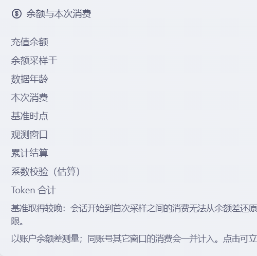

# dsh-balance-meter

[English](README.en.md) | 中文

DSH Web GUI 底部（输入框下方、官方统计胶囊那一行）常驻一行标注，实时显示：

- **充值余额** —— 取自官方账号服务（`deepseekAccount.getBalance`），就是充值余额本身；
  和官方账户卡片一样，**赠金余额不并进来**（赠金是发放/到期的，不是花掉的），
  它只在展开的明细里单独一行显示；
- **本次消费** —— 当前会话到目前为止花掉的钱，由**账户余额差**测量得出，不是本地按 token 估算。

点一下可以展开明细（充值余额、赠金余额、余额采样时间、本次消费、观测窗口、期间充值、
系数校验），点一下同时立即刷新一次余额。

```
余额 ¥4.56 · 本次 ¥0.2130
```


展开后是明细面板（与官方统计胶囊点开的浮层同一套样式；截图已裁去右列数值）：



## 为什么用「余额差」而不是按 token 估算

DeepSeek 只对外提供一个关于钱的准确数字：账户余额。它没有"按会话查消费"的接口。
所以某一次会话的准确花费只能这样还原：

```
本次消费 = Σ max(0, 上一次观测余额 − 这一次观测余额)
```

在会话存活期间记录的观测序列上求和；余额**上升**的那次不算消费（那是充值或赠送），
只记为「期间充值」并把基准一起抬上去。因为计费是随请求结算发生的，这个差值会收敛到
官方账单，而不需要我们在本地重新给任何一个 token 定价。

明细里的「系数校验（估算）」是另一条独立线索：把该会话在宿主侧累计的 token 用量按配置
单价折算成金额，用来交叉验证余额差是否合理。**它永远不会成为主数字**。

## 安装

```sh
# 本地目录（开发调试：改完跑 pnpm run build 再刷新页面，link 安装无需重装）
dsh plugin --profile <profile> add link:/绝对路径/dsh-balance-meter

# npm（尚未发布，见下方「发布」）
dsh plugin --profile <profile> add dsh-balance-meter@latest
```

`<profile>` 换成你实际使用的 profile 名（例如 `desktop`、`web`）。
装好后**重启一次 dsh**（宿主半需要重新加载），刷新页面即可看到标注。

不想用命令时，等价的手工做法：在 profile 的 `package.json` 里加依赖，再在 profile 的
`cordis.patch.yml` 里加：

```yaml
- insert:
    - id: dsh-balance-meter
      name: dsh-balance-meter
```

### 从源码构建

本包把构建产物（`lib/`）一并提交，所以 `link:` 安装不需要构建步骤；只有改代码时才需要：

```sh
git clone https://github.com/Amo-aibiancheng/dsh-balance-meter.git
cd dsh-balance-meter
pnpm install
pnpm run build          # tsc 出 lib/types，tsdown 出 lib/index.js 与 lib/client.js
dsh plugin --profile <profile> add link:$PWD
```

改客户端半时开着 `pnpm run watch`，改完刷新页面即可；改宿主半需要重启 dsh。

## 配置

全部有默认值，改配置就是改 profile 的 `cordis.patch.yml` 里那一行的 `config:`：

```yaml
- id: dsh-balance-meter
  name: dsh-balance-meter
  config:
    pollIntervalMs: 45000      # 余额采样间隔（5000 – 1800000），下限是给官方接口留的余量
    requestTimeoutMs: 20000    # 单次余额查询超时（3000 – 120000）
    anomalyRatio: 0.5          # 单次跌幅超过余额的这个比例 → 视为账号事件，不计入会话
    showTokenCrossCheck: true  # 明细里是否给出 token 折算的交叉校验
    price:                     # 仅供交叉校验使用（元/百万 token）
      currency: CNY
      cacheHit: 0.1
      cacheMiss: 3
      output: 9
```

`Config` 是按官方插件同款写的 **schemastery schema**（不是手写默认值对象）：加载器会调用
schema 本身来解析这一行，纯对象会让插件行**直接加载失败**——这正是第一版崩在
`failed to import` 的原因，现在由 `test/host.test.mjs` 的激活用例守着。

越界值会被 schema 直接拒绝，不会流到官方接口。所有可调字段都是 `volatile()`：在设置里改动
会**立刻**作用于正在运行的这一行（宿主每读一次配置都经过 `.get()`），无需重启。

## 算法与边界

| 情形 | 处理 |
| --- | --- |
| 会话创建时插件已在观测 | 以会话出生时刻的余额为基准，差值即本次消费（`基准 = session-start`） |
| 会话早于本进程（插件是后来才启动的） | 以已知最早的一次观测为基准，并在明细里标注「本次金额是下限」（`partial`） |
| 余额上升（充值 / 赠送 / 退款） | 不计为消费，记入「期间充值」，基准一起抬高，后续消费仍然准确 |
| 同一余额被重复读到（重试 / 双开轮询） | 视为同一次观测，直接丢弃：这是"绝不重复计费"的根据 |
| 单次跌幅超过余额 50% | 视为账号级事件（赠送到期、钱包切换），重新取基准而不是记成消费 |
| 观测乱序到达 | 插入到时间线中正确的位置；"当前余额"始终取时间最新的那次观测，不会被旧值覆盖 |
| 币种消失/切换 | 不做跨缺口差分，直接重新取基准 |
| 余额读取失败 | 记为不可读，绝不当成 0，因此不会凭空造出一笔消费 |
| 账户有赠金 | 主数字只显示充值余额（与官方账户卡片一致），赠金单独一行；两者永不相加 |
| 两次消费间隔很短 | 只要金额不同就分别计入（曾经用过"最小间隔"保护，结果会**漏掉真实消费**，已删除该规则） |

**已知边界（如实写在明细里，不藏）**：钱包属于**账号**，不属于会话。同一个账号在另一个
窗口或另一台机器上的消费会落进同一个差值里。单客户端、单账号时这个差值就是准确的；同时
多开时「本次消费」会偏大。同理，插件的采样是轮询的，两次采样之间的账会被合并进下一次。

## 实现结构

```
src/core/ledger.ts      纯函数算法核心（无 Node、无 DOM）：观测时间线 + 每会话累加器
src/index.ts            宿主半：schemastery Config、读官方余额、轮询、token 记账、/dsh-balance-meter/* 路由
src/client/index.tsx    浏览器半入口：注册 conversation.composer.dock 条目
src/client/BalanceChip.tsx  底部胶囊与明细面板（React，props 取自槽位声明）
src/client/format.ts    金额/时长格式化（子单位保留 4 位小数等规则）
src/client/wire.ts      两端之间的数据结构与 fetch（浏览器半只依赖它）
lib/index.js            构建产物：宿主半（ESM）
lib/client.js           构建产物：浏览器半（__ModuleLoader__ 闭包）
lib/types/**            构建产物：类型声明
test/ledger.test.mjs    算法用例：逐条钉住上表的每一行
test/host.test.mjs      宿主用例：真实 cordis 上的激活/卸载、路由、降级路径、Config 校验
test/client.test.mjs    浏览器半用例：模块格式、槽位注册、渲染
test/format.test.mjs    金额格式化用例
```

### 按 DSH 官方插件的约定写

- **TypeScript + 官方构建链**：`tsc` 出类型声明到 `lib/types`，`tsdown` 出 `lib/index.js`
  与 `lib/client.js`，与 `@deepseek-ai/*` 包自身的发布形态一致（`main` / `types` / `exports`）。
- **类型来自 SDK，不是猜的**：`PropsRuntime<'conversation.composer.dock'>` 直接取槽位声明的
  真实 props（`sessionId`、`useProjection` 由 `dsh-client-ui-session` 的模块增强提供），
  宿主侧用 `ctx.deepseekAccount` / `ctx.webServer` 的官方类型。`pnpm run typecheck` 就是这道闸门。
- **Config 是 schemastery schema**，可被设置页生成、可被加载器解析。
- **浏览器半不打包 React**：`react`、`react/jsx-runtime`、`@deepseek-ai/*` 一律留作
  `require()`，由壳的原生模块表解析；打进来第二份 React 会直接破坏 hooks 边界。
- **凭据不出宿主**：浏览器半只读本插件自己的路由，从不接触 token。
- **一份状态**：计费累加器只存在于宿主，多标签页不会各记各的账。
- **不抢宿主 UI**：只往 `conversation.composer.dock` 追加一个 list 条目（`order: 20`，
  官方统计胶囊仍是 `order: 0`），不覆盖任何既有座位。

## 开发

```sh
pnpm install
pnpm run check      # typecheck → build → test（49 条用例）
pnpm run build      # 只构建
pnpm run typecheck  # 只类型检查（对着真实 SDK 类型）
pnpm run watch      # 改客户端半时增量构建
```

`link:` 安装下改完代码跑一次 `pnpm run build`、刷新页面即可，不需要重装。

## 许可

MIT
